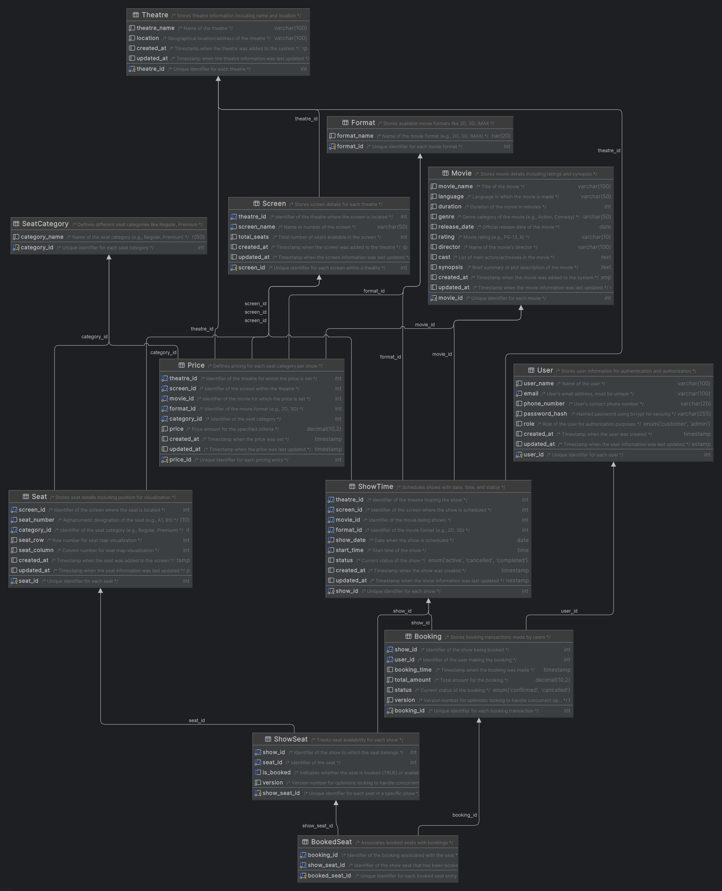

# Movie Booking System

This document provides an overview of the Movie Booking System database design, including the list of entities, their attributes, table structures, and sample SQL queries. The database schema is designed to follow 1NF, 2NF, 3NF, and BCNF normalization rules to ensure data integrity and eliminate redundancy.

## Table of Contents

1. [Entities and Attributes](#entities-and-attributes)
   - [User](#user)
   - [Theatre](#theatre)
   - [Movie](#movie)
   - [Format](#format)
   - [Screen](#screen)
   - [SeatCategory](#seatcategory)
   - [Seat](#seat)
   - [ShowTime](#showtime)
   - [Price](#price)
   - [ShowSeat](#showseat)
   - [Booking](#booking)
   - [BookedSeat](#bookedseat)
2. [SQL Schema](#sql-schema)
3. [Sample Data](#sample-data)
4. [Queries](#queries)
   - [P1: Table Creation Scripts](#p1-table-creation-scripts)
   - [P2: Shows Listing Query](#p2-shows-listing-query)
5. [Execution Instructions](#execution-instructions)

---

## Entities and Attributes

### User

Stores user information for authentication and authorization.

- **user_id**: INT, Primary Key, Auto-Increment
- **user_name**: VARCHAR(100), Not Null
- **email**: VARCHAR(100), Unique, Not Null
- **phone_number**: VARCHAR(20)
- **password_hash**: VARCHAR(255), Not Null
- **role**: ENUM('customer', 'admin'), Default 'customer'
- **created_at**: TIMESTAMP, Default CURRENT_TIMESTAMP
- **updated_at**: TIMESTAMP, Default CURRENT_TIMESTAMP ON UPDATE CURRENT_TIMESTAMP

### Theatre

Stores theatre information including name and location.

- **theatre_id**: INT, Primary Key, Auto-Increment
- **theatre_name**: VARCHAR(100), Not Null
- **location**: VARCHAR(100), Not Null
- **created_at**: TIMESTAMP, Default CURRENT_TIMESTAMP
- **updated_at**: TIMESTAMP, Default CURRENT_TIMESTAMP ON UPDATE CURRENT_TIMESTAMP

### Movie

Stores movie details including ratings and synopsis.

- **movie_id**: INT, Primary Key, Auto-Increment
- **movie_name**: VARCHAR(100), Not Null
- **language**: VARCHAR(50), Not Null
- **duration**: INT, Not Null
- **genre**: VARCHAR(50)
- **release_date**: DATE
- **rating**: VARCHAR(10)
- **director**: VARCHAR(100)
- **cast**: TEXT
- **synopsis**: TEXT
- **created_at**: TIMESTAMP, Default CURRENT_TIMESTAMP
- **updated_at**: TIMESTAMP, Default CURRENT_TIMESTAMP ON UPDATE CURRENT_TIMESTAMP

### Format

Stores available movie formats like 2D, 3D, IMAX.

- **format_id**: INT, Primary Key, Auto-Increment
- **format_name**: VARCHAR(20), Not Null

### Screen

Stores screen details for each theatre.

- **screen_id**: INT, Primary Key, Auto-Increment
- **theatre_id**: INT, Foreign Key (Theatre)
- **screen_name**: VARCHAR(50), Not Null
- **total_seats**: INT, Not Null
- **created_at**: TIMESTAMP, Default CURRENT_TIMESTAMP
- **updated_at**: TIMESTAMP, Default CURRENT_TIMESTAMP ON UPDATE CURRENT_TIMESTAMP

### SeatCategory

Defines different seat categories like Regular, Premium.

- **category_id**: INT, Primary Key, Auto-Increment
- **category_name**: VARCHAR(50), Not Null

### Seat

Stores seat details including position for visualization.

- **seat_id**: INT, Primary Key, Auto-Increment
- **screen_id**: INT, Foreign Key (Screen)
- **seat_number**: VARCHAR(10), Not Null
- **category_id**: INT, Foreign Key (SeatCategory)
- **seat_row**: INT, Not Null
- **seat_column**: INT, Not Null
- **created_at**: TIMESTAMP, Default CURRENT_TIMESTAMP
- **updated_at**: TIMESTAMP, Default CURRENT_TIMESTAMP ON UPDATE CURRENT_TIMESTAMP

### ShowTime

Schedules shows with date, time, and status.

- **show_id**: INT, Primary Key, Auto-Increment
- **theatre_id**: INT, Foreign Key (Theatre)
- **screen_id**: INT, Foreign Key (Screen)
- **movie_id**: INT, Foreign Key (Movie)
- **format_id**: INT, Foreign Key (Format)
- **show_date**: DATE, Not Null
- **start_time**: TIME, Not Null
- **status**: ENUM('active', 'cancelled', 'completed'), Default 'active'
- **created_at**: TIMESTAMP, Default CURRENT_TIMESTAMP
- **updated_at**: TIMESTAMP, Default CURRENT_TIMESTAMP ON UPDATE CURRENT_TIMESTAMP

### Price

Defines pricing for each seat category per show.

- **price_id**: INT, Primary Key, Auto-Increment
- **theatre_id**: INT, Foreign Key (Theatre)
- **screen_id**: INT, Foreign Key (Screen)
- **movie_id**: INT, Foreign Key (Movie)
- **format_id**: INT, Foreign Key (Format)
- **category_id**: INT, Foreign Key (SeatCategory)
- **price**: DECIMAL(10,2), Not Null
- **created_at**: TIMESTAMP, Default CURRENT_TIMESTAMP
- **updated_at**: TIMESTAMP, Default CURRENT_TIMESTAMP ON UPDATE CURRENT_TIMESTAMP

### ShowSeat

Tracks seat availability for each show.

- **show_seat_id**: INT, Primary Key, Auto-Increment
- **show_id**: INT, Foreign Key (ShowTime)
- **seat_id**: INT, Foreign Key (Seat)
- **is_booked**: BOOLEAN, Default FALSE
- **version**: INT, Not Null, Default 1

### Booking

Stores booking transactions made by users.

- **booking_id**: INT, Primary Key, Auto-Increment
- **show_id**: INT, Foreign Key (ShowTime)
- **user_id**: INT, Foreign Key (User)
- **booking_time**: TIMESTAMP, Default CURRENT_TIMESTAMP
- **total_amount**: DECIMAL(10,2), Not Null
- **status**: ENUM('confirmed', 'cancelled'), Default 'confirmed'
- **version**: INT, Not Null, Default 1

### BookedSeat

Associates booked seats with bookings.

- **booked_seat_id**: INT, Primary Key, Auto-Increment
- **booking_id**: INT, Foreign Key (Booking)
- **show_seat_id**: INT, Foreign Key (ShowSeat)

---

## SQL Schema

The complete SQL schema is provided in the `schema.sql` file. The schema includes the creation of all tables, constraints, indexes, and a stored procedure for fetching shows.



---

## Sample Data

Sample data is generated using the `sample-data.py` script, which populates the database with realistic entries. Below are examples of data in key tables:

### User Table Sample Rows

| user_id | user_name       | email               | phone_number | role     |
|---------|-----------------|---------------------|--------------|----------|
| 1       | John Doe        | john@example.com    | 1234567890   | customer |
| 2       | Jane Smith      | jane@example.com    | 0987654321   | admin    |

### Theatre Table Sample Rows

| theatre_id | theatre_name        | location                |
|------------|---------------------|-------------------------|
| 1          | Grand City Cinema   | 123 Main St, Anytown    |
| 2          | Regal Town Theatre  | 456 Elm St, Othertown   |

### Movie Table Sample Rows

| movie_id | movie_name          | language | duration | genre  | rating |
|----------|---------------------|----------|----------|--------|--------|
| 1        | The Silent Shadow   | English  | 120      | Drama  | PG-13  |
| 2        | Lost in Time        | French   | 110      | Sci-Fi | R      |

### ShowTime Table Sample Rows

| show_id | theatre_id | screen_id | movie_id | format_id | show_date  | start_time | status   |
|---------|------------|-----------|----------|-----------|------------|------------|----------|
| 1       | 1          | 1         | 1        | 1         | 2023-10-01 | 18:00:00   | active   |
| 2       | 1          | 2         | 2        | 2         | 2023-10-01 | 20:30:00   | active   |

---

## Queries

### P1: Table Creation Scripts

The SQL scripts for creating the tables are provided in the `schema.sql` file. Below is an example of how to create the `User` table:

```sql
CREATE TABLE IF NOT EXISTS User (
    user_id INT PRIMARY KEY AUTO_INCREMENT COMMENT 'Unique identifier for each user',
    user_name VARCHAR(100) NOT NULL COMMENT 'Name of the user',
    email VARCHAR(100) UNIQUE NOT NULL COMMENT 'User\'s email address, must be unique',
    phone_number VARCHAR(20) COMMENT 'User\'s contact phone number',
    password_hash VARCHAR(255) NOT NULL COMMENT 'Hashed password using bcrypt for security',
    role ENUM('customer', 'admin') DEFAULT 'customer' COMMENT 'Role of the user for authorization purposes',
    created_at TIMESTAMP DEFAULT CURRENT_TIMESTAMP COMMENT 'Timestamp when the user was created',
    updated_at TIMESTAMP DEFAULT CURRENT_TIMESTAMP ON UPDATE CURRENT_TIMESTAMP COMMENT 'Timestamp when the user information was last updated',
    CHECK (email LIKE '%_@__%.__%') -- Simple email format validation
) COMMENT 'Stores user information for authentication and authorization';
```

### P2: Shows Listing Query

To list all the shows on a given date at a given theatre along with their respective show timings, the following stored procedure is used:

```sql
DELIMITER //
CREATE PROCEDURE GetShowsForTheatreAndDate(
    IN p_theatre_name VARCHAR(100),
    IN p_show_date DATE
)
BEGIN
    SELECT
        m.movie_name,
        m.language,
        m.rating,
        DATE_FORMAT(s.start_time, '%h:%i %p') AS start_time,
        f.format_name,
        IF(
            EXISTS (
                SELECT 1 FROM ShowSeat ss WHERE ss.show_id = s.show_id AND ss.is_booked = FALSE
            ),
            'Available',
            'Houseful'
        ) AS availability
    FROM
        ShowTime s
        JOIN Movie m ON s.movie_id = m.movie_id
        JOIN Format f ON s.format_id = f.format_id
        JOIN Theatre t ON s.theatre_id = t.theatre_id
    WHERE
        t.theatre_name = p_theatre_name
        AND s.show_date = p_show_date
        AND s.status = 'active'
    ORDER BY
        m.movie_name,
        s.start_time;
END;
//
DELIMITER ;
```

To execute the procedure:

```sql
CALL GetShowsForTheatreAndDate('Grand City Cinema', '2023-10-01');
```

---

## Execution Instructions

### Prerequisites

- Docker and Docker Compose installed
- Python 3.x installed
- Required Python packages: `mysql-connector-python`, `Faker`, `bcrypt`

### Steps

1. **Set Up MySQL Database**

   Use the provided `docker-compose.yml` file to spin up a local MySQL instance.

   ```bash
   docker-compose up -d
   ```

2. **Initialize Database Schema**

   Execute the `schema.sql` file to create the database and tables.

   ```bash
   docker exec -i mysql-local mysql -uroot -proot_password < schema.sql
   ```

3. **Insert Sample Data**

   Run the `sample-data.py` script to populate the database with sample data.

    Ensure you have Python, MySQL connector, and Faker and BCrypt installed. Use the following commands to install the dependencies:

    ```bash
    pip install mysql-connector-python faker bcrypt
    ```


   ```bash
   python sample-data.py
   ```

4. **Test the Stored Procedure**

   Access the MySQL shell or use a MySQL client to call the stored procedure.

   ```sql
   CALL GetShowsForTheatreAndDate('Grand City Cinema', '2023-10-01');
   ```

---

Please ensure all the SQL queries are executed in the correct order and the database connection parameters are set appropriately.

---

**Note**: The sample data is randomly generated and may vary with each execution.